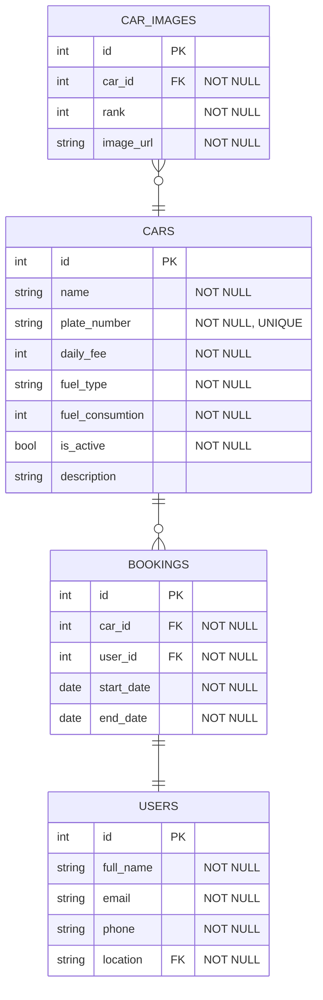

# UDEMX Car Rent project
*I made this project with all my heart and with the help of some YouTube video, a lot of googling and of course ChatGPT.*

---
I want to say thank you to forced me to refresh my knowledge about Java, practice Git and learn Spring Boot, JPA, Docker and the other project related technologies.

I sorry to say that this is not a safe and properly working project, but I hope you enjoy it and sometime I will have a chance to work and learn with you furthermore!

## Project Overview
### Database

I used a PostgreSQL database. I just created it without any table, and added it to a user with this credentials:

| Database Name   | User name | Password |
|-----------------|-----------|----------|
| udemxcarrent    | udemx     | udemx    |

You can find this information also in the [application.properties](src/main/resources/application.properties) file.

## User manual
### Init the project
You need to create a PostgreSQL db with the details above, otherwise, you just have to start the project and everything should work how it works.

### How to use
#### Admin apge
You can reach it in the /admin page.
There is a table with the bookings and a car editor part. In the car editor part add some cars, so you will be able to check the first task.

You can create and edit the cars also the related images. For the images **use public image URLs**! If you want to change the order of the images, you can drag and drop them.

If you don't want to use the car (deactivate) just uncheck the checkbox at the top of the form!

#### User page
First you need to select a date range in the dateRangePicker and click apply. You should see all the available cars in that time period which are active.

To book them, just click **on the card but not on the image** and fill the form!

## Known bug list
- Car inactivation not handle existing bookings
- Input field type may be other than it should be
- Backend doesn't check if the car still available if you try to book

## Future TODO
- Write tests
- Containerisation
- Security check (XSS, authenticate /admin)

## Contact info
- Email: fabnor99@gmail.com
- Phone: +36 70 / 577 4571